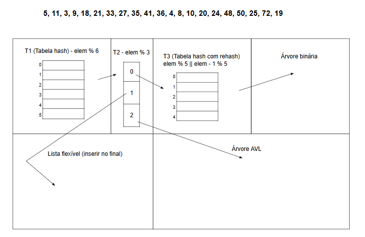

# Estrutura híbrida (ou Doidona para alguns)

Clique [aqui](https://docs.google.com/drawings/d/1eebd7uk9GLFLCuq0Ce7gF7lvdWito4-pMG8BbKd7xcE/edit?usp=sharing) para pegar a estrutura híbrida sem resposta - para aqueles que não gostam de usar papel.

#### Preview (Está no Google Drawing):
